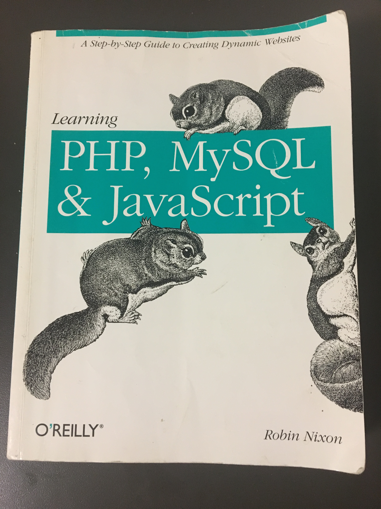

As a programming language polyglot, I was excited to learn that Javascript would be the language of choice in my Software Engineering college clourse. I had skimmed a copy of O'Reilly's squirrel-covered book titled "Learning PHP, MySQL, & Javascript" in the past. One of the course assignments for the Software Engineering class was to fulfill the Javascript portion of the online learning module on freeCodeCamp. I found the site's camel cased online icon comical.

  

Having learned object-oriented languages in the past, the learning curve for Javascript was not steep, if noticeable at all. A lot of the data structure concepts and methods from C++ and Python translated clearly. I found Javascript to be more friendly for software engineering purposes, mainly due to not having to specify types outside of their initialization. The learning occurred swiftly, which I am thinking ocurred mostly due to the online model. The model blended explanation, coding practice, and assessment into one. I was able to learn about a concept, practice it in code, and move on to the next after showing proficiency. I could also go back and receive needed clarity on concepts. This gave way for a different pace than did the O'Reilly learning method. It was in this questioning that I found the benefits of flipped-classroom models of learning. 

I had the priviledge of being taught by flipped-classroom trailblazer teacher, Crystal Kirch. Kirch was my Math Analysis professor (to view my class blog, themed after a chapter of the *Ender's Game* novel, click [here](http://ivanlperiod4.blogspot.com/) ) in high school and has authored a [book](https://www.barnesandnoble.com/w/flipping-with-kirch-crystal-kirch/1123824703?ean=9780692661901&st=PLA&sid=BNB_DRS_New+Core+Shopping+Books_00000000&2sid=Google_&sourceId=PLGoP164972&gclid=EAIaIQobChMIk9P95_nr2AIVmMBkCh11fwi1EAkYASABEgLWYPD_BwE) on flipped teaching titled "Flipping with Kirch" that has received praise and critiques within the teaching community. My experiences with flipped teaching have always been positive. I like the ability to move at my own pace and to receive clarification on the specific parts that are of challenge to me without the unnecessary teacher-student guessing game of finding the area of confusion. 

<a href="https://twitter.com/crystalkirch?lang=en"><i class="large twitter icon "></i>Crystal Kirch on Twitter</a>

My Software Engineering course is modeled similarly, and I belive this model of teaching enabled my Javascript learning experience to be a positive one. The course features Workout of the Day (WODs), a take on crossfit workouts. These exercises quiz us on concepts in a fun and engaging manner that both challenges and prepares us for in-class assessment. I cannot think of better practical practice for future technical internship coding challenges. I have found this approach to interview preparation to be more inviting and stimulating. Will I ditch my squirrel covered books from now on? Maybe not fully, but I will consider supplemental ways of learning. 

  

