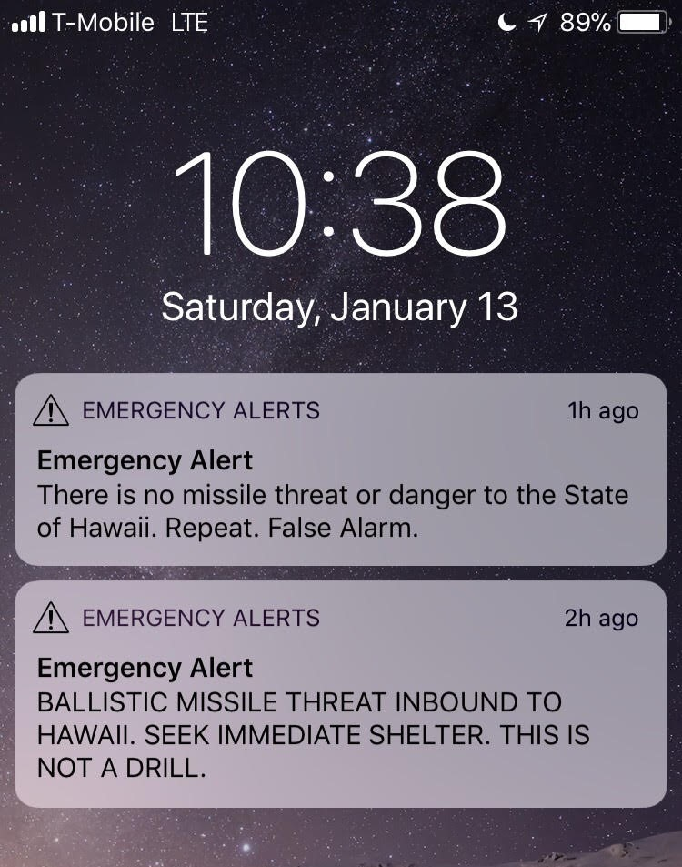

Welcome to Hawaii! You have 30 minutes!

  

First weekend into the Spring semester of my junior year of college at the University of Hawaii at Manoa I received the notification above on my phone. It was Saturday, and it was my first time surfing. I looked forward to practicing the sport while I lived on the island of Oahu. My excitement was met with despair. On our way to Diamond Head Beach my phone displayed this message which many of us read outloud. We did not know how to react. Around we saw people of all characteristics: crying, ambivalent, some accepting. There is no correct emotion to display when your life is threatened and your safety is under attack. Recent tensions with North Korea had led me to google interesting facts about missiles in the past. I remembered a fact stating a ballistic missile takes around 30 to 35 minutes to hit. We were being driven by a van and had no option but to do what the driver decided. We decided to head back towards campus to try and take shelter in our dormitories. Almost at the college, we found out it was a false alarm, with speculations about human error going around. It was not a simple mistake. My phone was filled with messages from family, friends, and loved ones wishing me their last thoughts. I responded to each alerting them that I was okay and that the ordeal had been a false alarm. My account is one of many retellings; among others stories I heard of people kissing the ground goodbye, aware that an attack on an island this small could mean total destruction, as well as students running in despair. I even heard about a student who moved back home under their parent's request that the island was not a "safe" location to live in.

The above description was caused by a tiny human mistake. An erraneous click of a mouse. The screen the person was looking at is said to be the following (according to Honolulu Civil Beat):

  

Many were relived, others upset, mad, and among many confused. How can a human make such a grand mistake? Wasn't there a sequential order to issuing such alert? Whose fault was it REALLY? My answer: the User Interface of choice. As humans we are aware that communication is very important. How we present information, I would say, is just as important as the facts themselves. If that menu had a cleaner, more dynamic look than look like clickable URLs, mistakes, such as the one described above, would occur less or cease to exist at all. The solution to minize or avoid such mistakes would be a streamlined, dynamic, clear user interface.

Today's computer scientists are multi-faceted. This is for functional purposes, not just a simple outcome of career specialization. A software product has many components which many have come to categorize as "back-end" and "front-end." Frontend people specialize in programming, functional components of a product whereas backend people care about the design and appearance of the product; essentially, what the user interacts with. The instance causing the Hawaii ballistic missile crises exhibitis very poor, elementary HTML and (maybe) CSS. The options are blue text formatted all alike, with only the words themselves differentiating each option from the other. Any person who values clarity would cringe. It is clear that to have properly functioning systems in place there needs to be a good user interface. 

There are existing, successful frameworks today that help such an important aspect become a possible reality. It is easy to think in a pragmatic sense and forget why aesthetics are important, but events like such remind us exactly why they are. It is worth taking the time to think about and implement clear, helpful design to add to functional programs. This not only increases the range of the audience using the products, but also shows that a product was made with users in mind. Society cherishes structure and this is another instance of structurally important elements that must be prioritized to achieve good results. For example, a simple styling of the different screen options could have prevented such a scary day for all Hawaiian residents from occuring.
