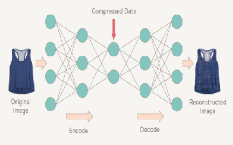

  
  
  

Current graphic design processes entail using generalized styles and themes with human-made decisions of content and style interplay. The task to interplaying content and style representations has been attempted using convolutional neural networks. CNNs are trained on images and used to learn input representations. The network finds representations based on details that it learned to focus on during training. In this paper, we explore the use of a parallel-branch CNN autoencoded architecture to learn input representations and blend an output image. The unsupervised blending of features is an interesting approach to this task, removing explicit bias towards either content or style. 

Our process seeks to automate the poster-making process of graphic design. Previous work attempting similar interplaying of content and style has not proven successful in recognizing textual bodies. Most of the previous work implementations are trained on objects and thus, text appears to be generalized as an object body, indistinguishable from other content. To successfully automate graphic design, the style must be applied to the textual image, all while preserving content details. Our network is able to recognize content as words, however, it is unable to distinguish between different words. We believe the cause of this is the inability of using autoencoding to capture high-level abstract features. 

My role in this project included designing the ideal network architecture as well as implementing the code to synthesize style and content. I learned a lot about the process of autoencoders, something that I used to view as a blackbox mechanism. I learned the abilities and limits of autoencoders, a vital piece to the future of similar work. We concluded that autoencoders might not capture features as well as we thought they could. This would be bad for the content aspect of this project. If the details of poster cannot be accurately represented, an ideal poster cannot be formed. We found autoencoders had their advantages despite this. Data processed through autoencoders retains general information and can help in cases where details are not as important. They can also be modeled in ways that would result in faster processing, since they are composed of fewer neurons. This means they can be helpful in domains such as self-driving cars, computer vision, etc. 

Here are some pictures that illustrates how our network blended style and content:

  
  
  

