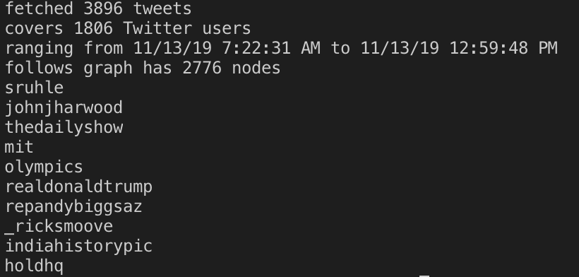

## Test-First Programming

A series of tweet-inspecting functions were written, to be used on tweets downloaded from twitter. The workflow followed a test-first principle, ensuring method specifications were followed carefully. Unit tests were written according to the method specifications before implementation. Upon implementing, tests were ran and the implementation could be revised to meet any required changes.

The unit tests were written based on a partitioning approach. Each test suite defined a partitioned input/output space for each method. 

### Extracting

The first series of methods involved extracting data from tweets. This includes getTimespan() and getMentionedUsers(), which are defined by their mehtod names. 

### Filtering 

The methods for filtering tweets include writtenBy() , inTimespan() , and containing(). These methods seek to separate tweets based on author, time written, and keywords. 

### Inferring a social netowrk

The method guessFollowsGraph() attempts to create a social network based on people mentioned on tweets. This social network is an approximation on who follows whom on twitter, based solely on the information in tweets. 

The influencers() method returns a list of people ranked by their influencee (number of followers). For these methods, hashtables were made to infer a social network. The use of this data structure was determined based on speed and accuracy.

An example of methods written are shown below:

This testing implementation is borrowed from <a href="https://ocw.mit.edu/ans7870/6/6.005/s16/psets/ps1/">MIT's</a>
