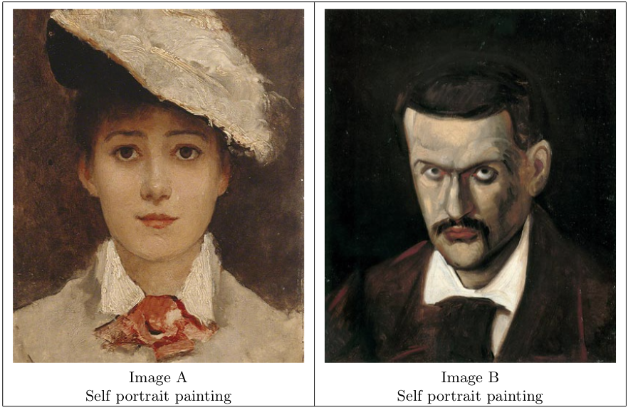
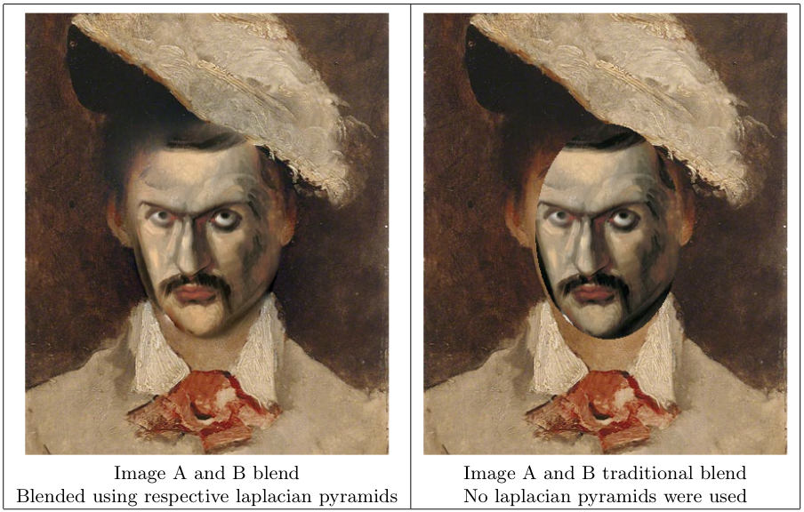
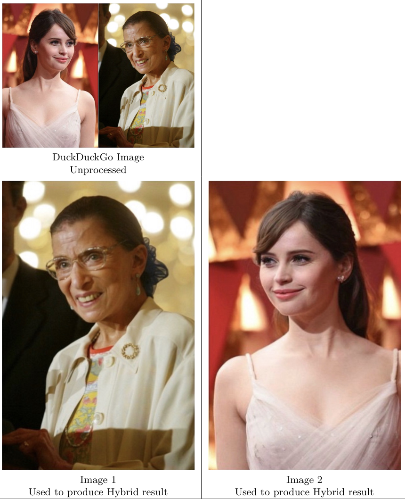
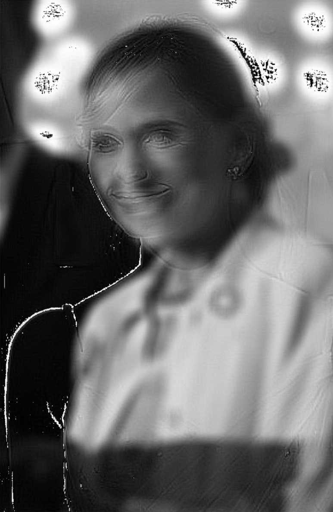
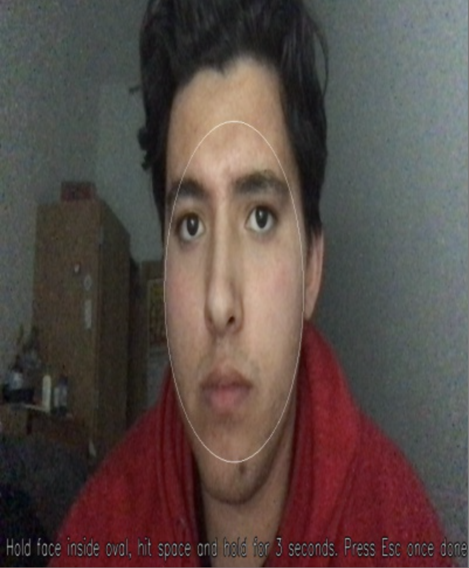
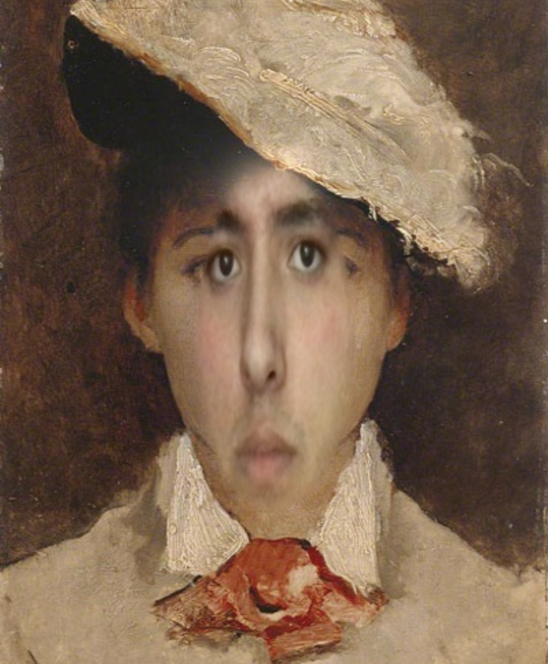

The concepts of laplacian pyramid building and image blending can be used to smoothly blend two images using an alpha mask as well as to build a hybrid image. 

# Obtaining and Preparing Source Images

The images for the image blending task were grabbed from DuckDuckGo's image search engine. Two self-portrait paintings were chosen. The dimensions were matched using cv2.resize, according to the smallest image's dimensions. Since one of the pictures was smaller in both dimensions, there were no encountered issues with the resizing process. The two input images used in laplacian pyramid blend are shown below. When scouting for images, I attempted to find portraits where the area of one person's face was in the relative vicinity of the other.

The chosen hybrid image was inspired by "On the Basis of Sex" starring Felicity Jones playing as Supreme Court Justice Ruth Bader Ginsburg. The inspirational story detailing the fight against gender discrimination deserved a feature. The images were found on DuckDuckGo's image search engine and sent to an iPhone XR, where it was cropped. The images were resized using cv2.resize, according to the smallest image's dimensions. The images found were taken from a profile angle that helped match facial features between images (eyes align with eyes, nose aligns with nose, etc.).

# Generating a Laplacian image

The laplacian pyramid was built to a depth that would keep the coarsest level to be about 8-16 pixels in its minimum dimension. The coarsest level of the six-level pyramid for the 400 by 486 (width x height) input image had a size of 13ˆ16 pixels. An extra level would make the coarsest level 7 x 8, which was too coarse.

# Blending Laplacian Pyramids

The Laplacian pyramid blending performed in this project blends low-frequency content over a larger distance than high-frequency content. This is to make images appear "smoother" as they are blended together. The choice to blend low-frequency content over a larger distance proves a smart move when seeing the results. The blend of one facial plane of an image to facial plane of the other image is a smooth transition, clearly different than a traditional blend. The high-frequency content is blended over a short distance; this content corresponds to higher-level details such as edges and lines. The goal to blend this over a smaller distance because these sort of details make image blending appear choppy and not as smooth.

As one see in the blended image output that uses laplacian pyramids, the low-frequency content (ie: color) is blended over a larger distance, however, the result is a smooth surface that resembles an even skin tone. Another thing one can see from this blend is the left eyebrow smoothly transitioning onto the face of the original image. This highger frequency content is not blended over a large distance, making our image appear more smooth and realistic.

# Hybrid Image 

The values used in the hybrid image generation were arrived at through a trial-and-error process. One of the images is recognizable from a long distance even if it was really fuzzy. One of the images is recognizable from a short distance because its features are more pronounced over its blurry foundation image. 

Once those featurees were recogniized, constant sigma_A was given a Gaussian standard deviation value of 100 and sigma_B was given a value of 20. The kernel for lopass(A) was set to be size (31,31) compared to the kernel used in hipass(B) which was size (7,7). The values are odd due to the requirement by $cv2.GaussianBlur$ function. The kernel used in hipass(B) iis smaller and has a smaller standard deviation because this gives enough facial features from the image that they are pronounced over the lopass(A) image without interrupting it when seen from afar. Using a lower Gaussian standard deviation or a bigger kernel would result in a more pronounced result with stronger edges. The bigger kernel and higher Gaussian standard deviation was used in lopass(A) because the goal was to have it to be blurry enough that it is unrecognizable from up close, but not too blurry that you cannot make out the person from afar.

The hybrid image result can be seen from as near as normal computer posture. When up close, my friends I both recognized actress Felicity Jones.

To see Ruth Bader Ginsburg, one has to step back about 2-5 steps (where one step is about a foot). 

## Interactive Picture Blend

To achieve the task, I ask the user to hold their face for a few seconds inside the oval area after clicking the space bar. If the user does not get it on the first try, they can simply try again. Once the user feels confident thye have captured their face inside the oval, they can press the 'Esc' key on their keyboard and exit.

The frame is then resized to match the blended image input dimensions. A mask is used to blend the area portion of the user snapshot to both input images. The result is a smoothly blended face swap image. 

The experienced lag is most likely due to processing each frame to draw an oval and add the user prompt label. That is why the user is instructed to hold 3 seconds. If the user does not pick a picture, input imageA becomes the image to be blended.

Source: <a href="https://github.com/ilomeli450/Thresholding-And-Blob-Tracking"><i class="large github icon"></i>Github Repo</a>

