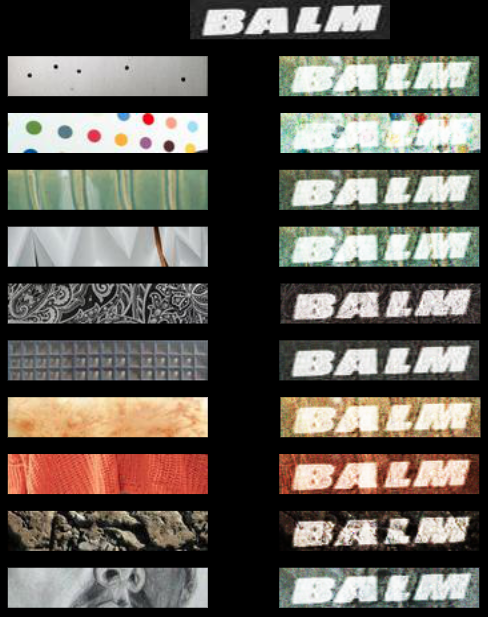

## Motivation
Current graphic design processes entail using generalized styles and themes with human-made decisions of content and style interplay. The task to interplaying content and style representations has been attempted using convolutional neural networks. CNNs are trained on images and used to learn input representations. The network finds representations based on details that it learned to focus on during training. In this paper, we explore the use of a parallel-branch CNN autoencoded architecture to learn input representations and blend an output image. The unsupervised blending of features is an interesting approach to this task, removing explicit bias towards either content or style. Our process seeks to automate the poster-making process of graphic design. Previous work attempting similar interplaying of content and style has not proven successful in recognizing textual bodies. Most of the previous work implementations are trained on objects and thus, text appears to be generalized as an object body, indistinguishable from other content. To successfully automate graphic design, the style must be applied to the textual image, all while preserving content details. Our network is able to recognize content as words, however, it is unable to distinguish between different words. We believe the cause of this is the inability of using autoencoding to capture high-level abstract features. 

## Introduction

Graphic design is a process that is heavily subjective but largely motivated by themes and styles. Generalizing these styles and themes could be a way to remove the human element from the process, making it less labor intensive. The way the visual cortex cells pay attention to salient features, by activating (or, firing), is similar to the way neural networks pick up feature representations from image inputs. If the process of poster making can be automated, aesthetically-pleasing posters can be produced by interplaying a content image with a desired style image. The use of convolutional neural networks has largely leaned towards image recognition/classification, however, we explore the use of an autoencoded CNN to achieve a successful interplay of arbitrarily-chosen content and style. 

# Convolutional Neural Networks (CNNs)
Humans see an image and quickly identify the environment and objects within the picture, whereas convolutional neural networks see an array with dimensions of pixel height x pixel weight x 3, representing RGB pixel values. This array then undergoes a series of layers, with each layer performing various simplification tasks. The first layer of almost every CNN is a convolutional layer. In this layer, a kernel filters over all regions of the image, focusing, or convolving, on different receptive fields (image areas) at different time steps. The kernel itself is another array of numbers, known as weights. As it convolves across the image, it multiplies the values in the kernel with the original image pixel values. The sum of the kernel multiplication values are added to form a single number for the respective filter area. After the kernel filters over the entire image, moving either pixel by pixel or some other stride value, the summed values belonging to each area form an array of numbers known as a feature map. 

Each kernel, also called a filter, identifies different features from the input image. These features range and include edges, curves, colors, etc. Traditional CNN architectures include other layers, such as pooling layers, that help provide nonlinearities and preserve dimensions. To implement nonlinearity in the system, an activation layer usually follows a convolutional layer. Research from Geoffrey Hinton led to a widespread use of Rectified Linear Units (ReLU) activation layers. ReLU layers increase training speed and help the lower layers of the network train faster than their usual slow training, which is due to the gradient of the error function decreasing exponentially through the layers, an issue known as vanishing gradient problem. In CNNs, weights update proportional to the error function gradient and the current iteration weight.  If the gradient becomes too small, it can prevent the weight from updating. To prevent this issue, ReLU layers simply overturn the negative activations by making them zero. 

A pooling layer, also known as a downsampling layer, chooses the highest values from the previously outputted array. For maximum pooling, the filter and stride are the same size. Through the process of convolving, the layer outputs the maximum number in every subregion that the filter passes until it scans the whole image, a process outlined in Figure 1. This process helps signal the activation of a specific feature without preserving information about its exact location. This helps lower the spatial dimension of the inputted feature map array. The amount of weights is thus reduced, lowering computation cost. The process of downsampling also controls overfitting. Overfitting occurs when a network is so fine-tuned to the training image inputs that makes it harder to generalize for inputs not seen during training. 

  

Visualization of maximum pooling

The outputs of the first convolutional layer and pooling layer pair, or feature maps, are the inputs for the next layer. By going through more upper layers and applying more filters, the feature maps represent more complex, higher-level features. The CNN network learns which features to look for and what values to use for the kernel activation array by adjusting its weights during a training process known as backpropagation. In order for backpropagation to function properly, a network must have a defined target.  

# Backpropagation
In image classification tasks, the purpose of a CNN would be to output a probability vector signaling what the network thinks the input is based on its learned features. The target is therefore a probability vector that more closely resembles the correct probability vector, with the right category vector value being the highest value in the output vector. Backpropagation includes a forward pass, loss function, a backward pass, and a weight update. The forward pass passes the training image through the entire network. The output that results from the forward pass is used to calculate a loss function, with mean squared error being the popular choice. The backward phase of backpropagation allows the network to determine which weights affected the loss the most and adjust them to decrease the loss value. In the weight update stage, the weights of the kernel filters are updated to lower loss. A complete four-phase backpropagation cycle applied to the entire training dataset is one training epoch.

# Autoencoding
Autoencoding, the method analyzed in this experiment, is a self-supervised learning method. Being able to learn representations without pre-determined labels, this method is an instance of supervised learning, where the targets are generated from the input data. Autoencoding methods contain three parts, an encoding function, decoding function, and a distance function. The encoding step in autoencoded networks involve reducing dimensionality inside the network hidden layer(s). The high-dimensional input data must be reduced in these layers since the hidden layer size is smaller, as seen in figure 1. Since the target in autoencoding is the input image, the outputs of the hidden layer are reconstructed to try to match the original input image in the output layer. Thus, in autoencoding the size of the output layer is always the same as the input layer. The distance function calculates the amount of information loss between the compressed and decompressed versions of the input data . The idea of using CNN autoencoded networks for identifying and reconstructing purposes has been contested before, as seen in recent literature. 

  

Visualization of encoding inside CNN. 

# Recent Literature}

Different works with a similar idea of interplaying content and style have been recorded, however, there are few that use an autoencoded CNN architecture. Gatys et al. attempt to create “artistic images of high perceptual quality” using a CNN “to separate and recombine content and style of arbitrary images.” Their implementation takes as input two images, an artistic piece representing style and a content image to be interplayed with the style features. Their CNN was trained to perform object recognition, learning to pick up lower-level features from lower convolutional layers and higher-level features from the upper network layers. In order to separate content, the authors reconstruct the content image using the lower layers. To separate style, the authors used a separate feature space and included style representations with computed correlations between different features across different CNN layers. The style of the input image is reconstructed from a subset of higher CNN layers, which discard information about global arrangement, an insignificant property of style when we are more concerned with content global arrangement, already preserved from lower layers. 

The process and architecture of the CNN network defined by Gatys et al. was implemented by Anish Athalye. In their implementation, the CNN network used was a trained VGG model (VGG19). We originally sought to explore their implementation and optimize parameters to achieve automated poster graphic design. After brief meddling, we noticed the possibility of improved results if the network were trained on various textual images as opposed to world objects, since successful posters greatly prioritize content clarity. We were unable to retrain the VGG network, and chose to seek an alternate method to interplay content and style. Autoencoding was a recommendation from Swarthmore Computer Science Professor Lisa Meeden. 

Autoencoding has few practical applications, as its traditional use involves reducing data dimensionality. It has however, been helpful in the task of image restoration. Autoencoding proved to achieve better performance than other methods in image denoising and inpainting. By using a deep encoding and decoding framework, the authors were able to combine convolution and deconvolution. This allowed them to extract primary image content to the level of details, something needed to successfully achieve image restoration. Their use of autoencoding to achieve content representation to such level was a result we wished to achieve in our implementation. Still, we had to be weary of the fact that the task explored by Mao X., Shen C., and Yang Y. is a different task than the one at hand. Thus, we turned to autoencoding used in other similar domains.

The task of reconstructing handwritten digit images using autoencoder neural networks greatly compares to our experiment. Experimenters seeking to achieve this task used hidden layers in an autoencoder neural network to reduce high-dimensional input data to smaller space (the process of encoding). The architecture used was a five-layer autoencoder neural network, depicted in Figure _ . The process of encoding and decoding, explained in section $1.3$, is better visibly represented in Figure _ . In the encoding section, the network is transforming high-dimensional input into lower-dimensions. The decoder part of the network reconstructs the original high-dimensional data from lower dimensions. Considering the issue of dimensionality and overfitting, we chose to aim for a simple-structure network architecture. Past deep neural network competitions have proven that sometimes, simpler is better, even for major, complicated tasks.

    
    
## Experiments
# Hypothesis 
We hypothesize that using the method of auto-encoding, we can improve feature translation and blending to create a readable output. Recent literature sets a precedent of autoencoded CNNs used to record detail-specific representations. An interplay of content and style can be achieved if features can be successfully learned and represented from a content and style image. We are interested in the result of blending content and style in an unsupervised manner. This approach contains less bias than other implementation, content and style are not explicitly weighted differently, they blend inside the final hidden output layer.  

# Data
 We use two different datasets in this experiment, both sourced from University of Oxford Information Engineering’s Visual Geometry Group. The first, our content dataset, is a dataset of 9 million computer generated words. The second, our style dataset, is a dataset of 5,500 categorized images of various textures. Since the shapes of the images of the two datasets are very different, with horizontal word images and square texture/style images, we focused on reshaping the data to 150 width x 30 height x 3 RGB values in order for our network to train in a quicker manner. The smaller the images, the fewer parameters our network will require to learn all of the pixels and features. This allowed us to extract two 150 x 30 images from the square style images. This doubled our style dataset to 11,000 images. 

# Network Architecture
Our network is a two branched autoencoded CNN. This means that we have two different CNN networks feeding into a hidden layer which precedes the output. Our parallel branch structure is made up of a left branch corresponding to content (word images) and a right branch corresponding to style (textural images), as shown in Figure \ref{architecture}_ . Each branch had an input layer, two convolutional layers, two max pool layers, a flatten layer, and a hidden layer. However, we did customize certain parameters in an effort to optimize each branch to achieve its goal of reproducing content or style. 

	

Parallel branch autoencoder CNN architecture used in experiment.

	

Two autoencoded CNN architecture models.

First, we decided to take a look at the kernel size of the convolutional layers for both content and style. We determined that since the content images are words that occupy most of the vertical space in the images, it could be beneficial to adopt a more vertical kernel size to help identify distinct features in words. Whereas in style images, it was quite easy for the convolutional layer to identify features of textures with a square kernel. 

We then looked at each branch’s hidden layer and its width (number of nodes in that layer). When we ran a model summary, we noticed that the content flatten layer was of a larger shape (7,000) than the shape of style flatten layer (2,000). This indicated to us that there was more to represent coming from the content branch. This helped influence our decision to make the content branch's hidden layer contain for times the nodes than the style branch\textquotesingle s hidden layer. 

Upon making these changes we experience better visual results to our network where we were able to discern more trained content images. 

# Training
We trained our network by alternating the branch that was propagated with data. In order to effectively do this, we created a dataset that alternated between appending content and style images. In order to not propagate or change the branch that was not being fed an image, we propagated a blacked out image through that branch. We did this because a blacked out image has RGB values of 0 across all of its pixels and is cannot influence the weights in the kernels. 
The biggest reason for creating our data set this way and training our network in a alternating fashion was to avoid catastrophic forgetting. Catastrophic forgetting is the idea that if we trained one branch of the network first and then the other branch, the first branch would be forgotten by our final hidden layer. Instead the hidden layer would be focused on the branch it was trained on second. 

# Tests

Testing our network is very exciting as this is the first time we are passing a populated image into both branches of the network. This changes our output from what our output was during training. The output during testing is intended to be a blended image of the content and style images. Interestingly, the output is very difficult for us, the researchers, to directly influence. The blended output is completely in the discretion of the trained network. 

 It is very difficult to quantify our results other than subjectively judging the outputs as a “successful” blend. Therefore in order to test our outputs, we created five different tests seen in Table 1. Not only do the tests help us find a way to subjectively quantify our results, it also helps us subjectively rank the output as successful or not. Specifically, we use a mix of content and style images the network has been trained on or has not yet seen (not been trained on). The reason we test with content and style images the network has not seen is to see how well our autoencoded CNN can recreate content and style  it has not been trained on. 

	

## Results}

# Improvements
Our first real result of our network was a result of a network trained on 11,000 content and 11,000 style images, our entire dataset. As a result, when we tested the network with content and style images, we received a grayed image back. What we had yet to understand was the importance of specific parameters. For example, our network's hidden layer could not represent all of the features it had learned because the number of nodes was too small. We learned that we needed to scale up our hidden layer's nodes as we trained on more images. 

 We then tested our tuned parameter network with a different number of training images. As we learned from our grayed output images from the network trained on our entire dataset, we had to scale up as we trained on more images. As a result we doubled the number of nodes in every hidden layer since we about doubled our training images every consecutive test. Figure _  shows the numbers of images trained on, epochs, and nodes in each hidden layer.

	

Shows the changing parameters of various networks and  the number of epochs. The networks are named based on the number of images they were trained on.

 Once we finalized our network parameters, our networks outputted the results seen in Figure \ref{results}. As seen in Figure _ , our 64 image trained network did not do well at all. This was because the outputs were grayed very similar to the network trained on our entire dataset. The reason was that we overestimated the number of epochs needed to train the network. As seen in Figure _ , a graph regarding our first three network \textquotesingle s accuracy shows that the 64 image network has been trained to 100\% for 600 epochs too long (1,200 epochs). This is where our 64 \* network comes into play. We find much better results training at 600 epochs which is where the network converges to 100\% and we get much better results. 

	

Demonstrates our results for the various tests we ran based on a subjective view of quality of the output.

	

Shows the training accuracy for the first three networks in Figure 2. Blue = 10 images, Orange = 32 images, Green = 64 images

As seen in Figure _ our results are consistent as we incrementally scale up our training image size by 2. Our results for all networks, except for the 64 image network, slowly decrease in quality as they are tested from tests 1-5.

## Discussion

	

Demonstrates semi-accurate quality results for Test 1.

 Unfortunately with consistent results comes consistent failed results. As seen in Figure _ , we were not able to get any quality blending images when testing the networks in test 5. Test 5 involves testing the networks on all unseen images, both content and style. None of the networks could correctly blend an output image that resembles either the content input image or the style input image. We believe that this could be a result of the autoencoding network’s inability to generalize well: “At this point there is significant evidence that focusing on the reconstruction of a picture at the pixel level, for instance, is not conductive to learning interesting, abstract features...”. Therefore we believe that more research must to be done on autoencoded CNNs for high-level feature scalability. We took a stab at this research by improving our style branch and increasing dimensionality by using an upsampling layer. This would allow a more direct, straightforward decoding step. Unfortunately, we received the same consistent results. 

However test 1, as seen in Figure _ , shows that we can produce a really good blended image of a fixed trained content image and trained style images. The fixed image we chose is a bolded content image (which the network was trained on). This type of content image (bolded, trained word) appears to make it easier for the network to reproduce content on the output. Similarly, the networks does well in test 2. Tests 1 and 2 solidify the idea that the autoencoded CNN is pretty good at reproducing both content and style images that it has been trained on. 

## Conclusion

Our autoencoded CNN architecture provides an unsupervised blending of content and style when given images it was trained on. We obtain three different networks, each trained on a different number of input images. The training images contained both content (word images) and style (texture images). Our training features an even split between both categories. After training on a various number of image files (10, 32, and 64), we analyze how our network performed in recognizing text. Previous work attempting similar interplaying of content and style has not proven successful in recognizing words. Most of the previous work implementations are trained on objects and thus, words appear to be generalized as an object body, indistinguishable from other content. To successfully automate graphic design, the style must be applied to the word image (content), all while preserving the word\textquotesingle s details. Our network is able to recognize content as words, however, it is unable to distinguish between different words, especially when they are not part of the training dataset. As shown in tests, it is able to interplay content and style when the inputs belong to the training set. When the inputs do not belong to network \textquotesingle s training set, the output is a word with similar structure (orientation, length, font style) to another word it recognizes from the training set. Thus, our network is not able to discern between words. We believe the cause of this is the inability of using autoencoding to capture high-level abstract features in CNNs. 

