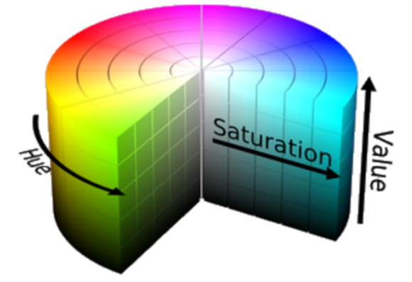
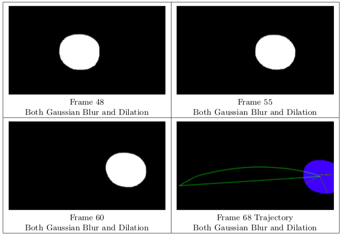
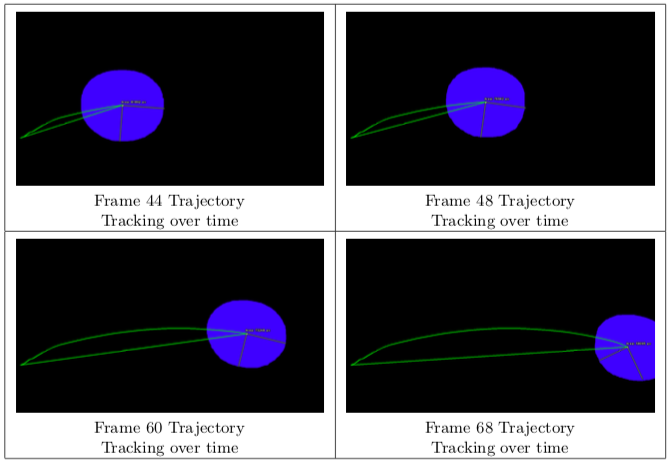

## Introduction 

The concepts of thresholding, morphological operators, connected components analysis, and tracking are central to the field of computer vision. Thresholding is a method used to distinguish objects of interest, with the outcome being a binary image where the foreground is represented by non-zero pixels and the background is zero pixels. I used an RGB-method of thresholding in this scenario, which will be further explained in the Methods section. Thresholded images can then be processed by morphological operators to better identify the object(s) of interest by eliminating noise and speckles. The resulting con- nected non-zero pixels can be tracked as connected components and the position of their centroids graphed over time. In this project, I used a video of an orange being hurled in front of a backdrop to build a system. The system is able to track the orange in the video over time by using the methods of thresholding, applying morphological operators, and tracking connected components.

## Methods 

Initially, there was an array of available options for processing their video frames. To threshold, I used RGB thresholding. Noise reduction was performed with the use of initial Gaussian blurring and dilation. These choices were deliberate and are explained in this section, as well as the assumptions taken in choosing each one.

# Thresholding and Morphological Operators

RGB Thresholding was the method used to threshold the video frames. The cv2 functions cv2.inRange takes in upper and lower HSV boundaries parameters. This defines the color space our object appears in. The outcome of the function is a binary mask. By using this method of thresholding I had to choose hard-coded values representing an HSV color range for orange. The range represents the total space in HSV that the object could exist in. The system is therefore limited by that specification. To find a blue colored object, the HSV range would have to be defined as well as its minimum and maximum. It is important to note that this method also works because there are no other orange-colored objects in our scene that the mask could pick up as other objects of interest. The system could have complications if another orange object or an object that wasn’t particularly orange but exists within our HSV color range was in the scene. The system implementation should, however, do well in different brightness conditions. As long as different brightness does not lead to the introduction of different colored hues, the given HSV range should account for brighter values of the color orange as well as dimmer values of the color orange. I now explore the methods used in the system.

   Thresholded images are not always perfect, sometimes parts of the scene can be detected as an object of interest when it is simply noise or an object improperly picked up by our thresholding method. In the scene of the orange, it seems that light bouncing from the surface of the orange was often believed to be a small orange speckle itself and identified as a connected non-zero pixel component. Morphological operators can be applied to our thresholded binary image to avoid noise and speckles.
   

   Before thresholding, an initial Gaussian blur was performed on the original color frame in order to reduce high frequency noise and put emphasis on structural objects. No down sampling was performed as the video was taken on an iPhone XR and the processing of frames was not taking painstakingly long. The image was then converted to HSV color space in order to use obtain the thresholded mask image. This was not enough to get rid of extra objects, as seen in the images below.

   After thresholding, dilation was used to get rid of the speckles that seem to reflect off the orange’s surface. Since these speckles appeared near the edges of the orange silhouette, a dilating morphological operator made most since. Dilating would make the orange area bigger, absorbing the extra speckles into the larger orange area.
   

## Results 

   Applying a Gaussian blur followed by dilation gives appropriate thresholded images. The images are relatively free of noise and speckles. The orange is well distinguished from the background. Dilation was performed with 10 iterations as this number of iterations yielded the best results, with the orange dilated enough to absorb nearby connected components, eliminating the extra objects.

# Binary Segmentation and Tracking

   The position of our object can be tracked over time now that we are able to distinguish the object in the scene (the orange) from the background. To plot the position of the object over time, the centroid of the connected component that is perceived to be our object is plotted in each frame. The result is a continous plot of our object’s trajectory over time.

## TA-DAH! 

   The system is able to distinguish objects in the frame using RGB-thresholding. The possible color values of our object are hard-coded, making it specific to locating objects within the specified color range. Thresholding would only work if the background is of a different color than the object; Otherwise, the object would be confused with the background and the system would confuse it for a connected component. The system uses Gaussian blur and dilation to remove noise and speckles from the video frames. Once the object is clearly distinguishable, the object’s centroid is tracked and recorded over time. The result is a smooth trajectory showing the path the orange took.

   Future applications could include estimating object speed from position plots or individual player sports tracking, among many different possibilities. Morphological operators prove to be simple yet helpful in isolate our object. An extension of this system would be to track two orange objects and record both object’s position over time separately.
   
Source: <a href="https://github.com/ilomeli450/Thresholding-And-Blob-Tracking"><i class="large github icon"></i>Github Repo</a>
