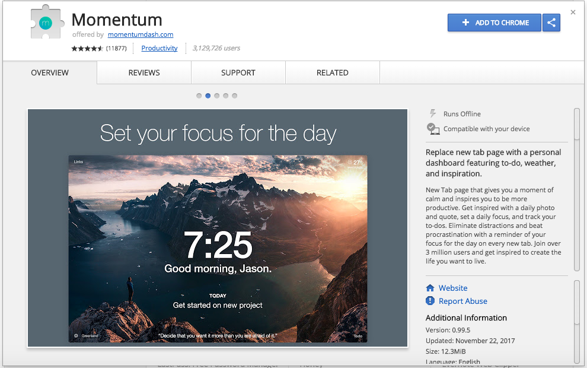

We all have at some point in our lives, tried to document our experiences. Whether it be a literal diary, a photo account, or the Notes app on the iPhone, documenting experiences is a part of the human experience. Along with two collaborators from Swarthmore College, I sought to create a user-friendly way of streamlining this process by creating a journal chrome extension. The inspiration came from the *Momentum* chrome exension. This browser dashboard presents an inspirational quote, the current time, and the day's focus. We wanted to create something that can add to a user's productivity as well as create a creative outlet. 

The inspiration: 

  

The idea came to design a browser extension that would allow a user to jot down details about the day that they hoped to keep. This information was individual and private, and we wanted to ensure it stayed that way. The user should also be able to recall information they have not yet saved. Any information that is finished and saved should not be available to the public. These were all properties that we had to implement. My role on the team was back-end implementation; I was in charge of the database aspect of saving journal entries. The security aspect of saving entries and keeping them unique to the user called for user authentication. We took advantage of the fact that we were designing a soon-to-be chrome extension, ultimately to be available on the Google App Store, and made it discern users based on their google e-mail log in. 

My role mandated I learn Firebase and Google user-token authentication. One of my initial projects, the experiences gained from working with two upperclassmen were very beneficial. I learned how to implement parts of our project that were based on topics I had not seen prior. I had to learn new methods of implementation, which introduced a learning curve. Learning how to collaborate with the other people working on the project gave me new skills. I learned how to efficiently and effectively seek answers. Although on backend, the nature of the project forced me to learn about other parts of the process pipeline. I learned front-end design is very important and crucial for user experience. Being aware of this, I learned how important the different parts of an overall project are, something I was priorly insensivite to.

<a href="https://github.com/Reflect-Swarthmore/reflect"><i class="large github icon "></i>Github</a>
