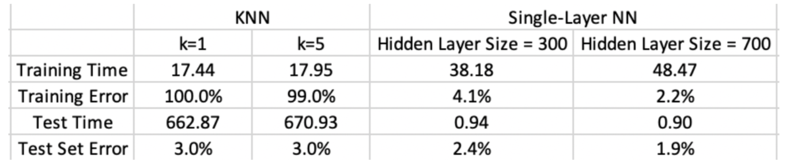
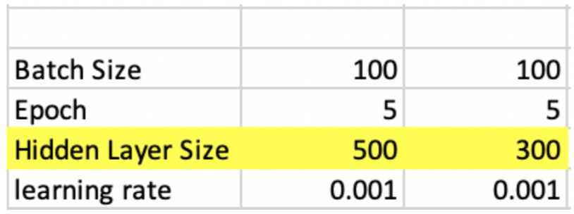

Alongside classmatee Xinyi Wang, we explore k-Nearest-Neighbor (KNN) classifier and the single-layer neural network. To build the single-layer neural network, we used the PyTorch framework and loaded the data directly from the torchvision.datasets class. We then modify the Module class from torch.nn to build our own neural net structure. 

## Setup

There were a few materials that helped us better understand the single-layer neural network and its implementation using PyTorch. Stanford CS231n Convolutional Neural Networks for Visual Recognition has one class on the hardware and software for deep learning, where they briefly cover PyTorch and show step by step how to simplify the implementation of a network in NumPy using the PyTorch framework. We also used the documentation and official tutorial of PyTorch. Our original implementation was not efficient enough, so we adapted the code of a feedforward neural network running on MNIST from a PyTorch tutorial repository on github. 
Source: <a href="https://github.com/ilomeli450/Thresholding-And-Blob-Tracking"><i class="large github icon"></i>Github Repo</a>

For the KNN classifier, we drew the model directly from sklearn.neighbors. Working with this model was straightforward, and we referred to the documentation of sklearn as our resource.

## Outcome

We tried out values of k = 1 and k = 5 for the KNN classifier. In the single-layer neural network, we chosee a hidden layer size of 300 and 500 nodes. The result are shown in the table below.

(Note: The training error of KNN is estimated using a sample size of 1000 from the training set due to the limitation on the computation power of cpu.)
Specifically, some important hyperparameters we used for the single-layer neural network are:

It is important to validate the final classifier on a separate dataset from the one it was trained on because we always want to measure the performance of the model on a new dataset which the model hasn’t seen. If we use the dataset on which the model is trained, we tend to overfit the model, which leads to poor performance on a random dataset. In addition, by having a separate test set, we can compare the testing and training error together to evaluate the variance and bias of the model and pick the effective method to improve the model correspondingly. For example, high test error and low training error indicate overfitting, high test error and low training error generally indicates underfitting, etc.

## K-Mans vs. Single-layer neural network
We assumed KNN to perform better than the single-layer neural network, since we assumed limiting the hidden layer number to 1 would ruin the magical performance of neural networks. However, the result we had showed that the single-layer network still outperforms the KNN classifier, especially when we increase the hidden layer size.
Changing k from 1 to 5 does not bring a significant change on how the classifier performs on the testing data, which is as expected, since in general there does not exist a linear correlation between the performance of the KNN classifier and and size of k. Instead, we could use cross validation to find the ideal k. In terms of KNN’s performance on the training data, when k = 1, the training error is naturally 0, since the ”vote” is the data point itself, and the training error when k = 5 increases a bit to 99%.

However, for the single-layer neural network classifier, the test error drops from 2.4% to 1.9% when increasing the number of hidden layer node from 300 to 700. And in fact, this is generally true: we can use a bigger network – a network with more hidden layers and more nodes in each hidden layers – to decrease bias.

The MNIST Database official website reports, without preprocessing the data, that the single-layer neural network achieved error rate of 12% (the number was reported in Yann LeCun’s paper published 20 years ago). We saw a higher accuracy rate in the single-layer neural network that we used, thanks to the newly developed techniques. One is the Adam optimizer, which gives us adaptive learning rate and momentum and in general faster convergence. In addition, we also used cross-entropy loss and mini-batch gradient descent. The use of mini-batch is crucial here. Originally in our code, we used batch training, and thus the model updated super slow and takes a lot of memory. The code we later adopted used mini-batch gradient descent and ran 5 epochs, which gave us good performance and high efficiency. The mini-batch size would be another interesting hyperparameter to play with if we did not choose the number of nodes in the hidden layer as the hyperparameter of interest.

Comparing the training and testing times of the two classifiers, we found that although as a lazy learning algorithm (KNN doesn’t have a training phase), it takes significantly longer to make prediction for each test sample. As for the single-layer neural network, once the model is built, it is capable of making predictions on the test data efficiently. Thus considering efficiency only, if we have a small test set, we might lean towards the KNN classifier; but with a large test set, we might prefer the single-layer neural network classifier.

