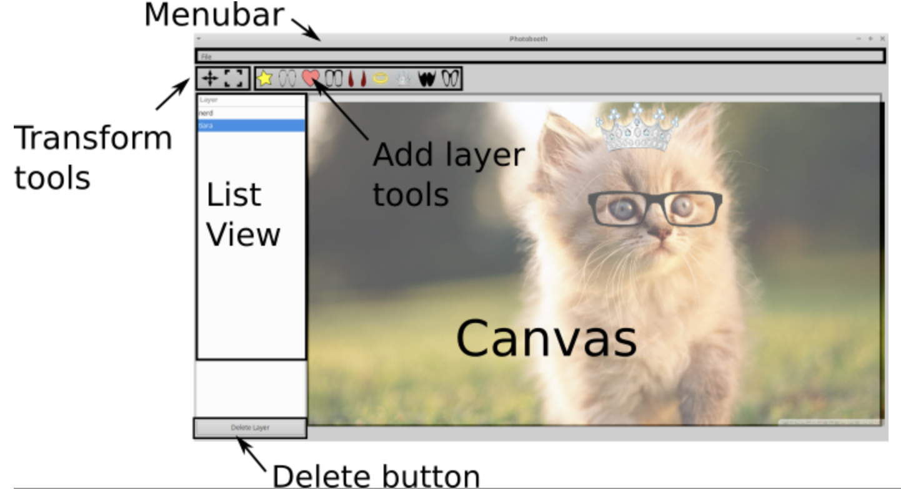
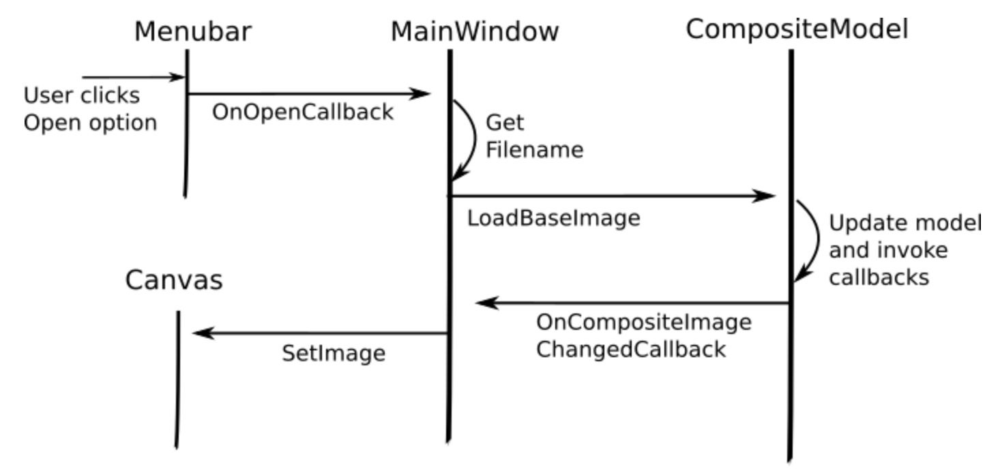
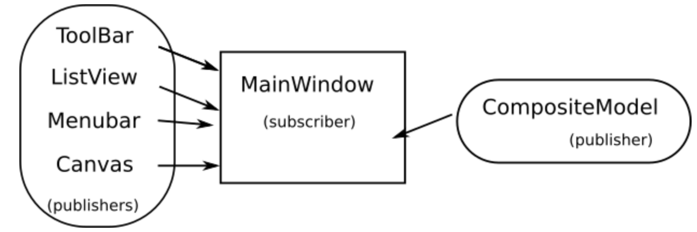
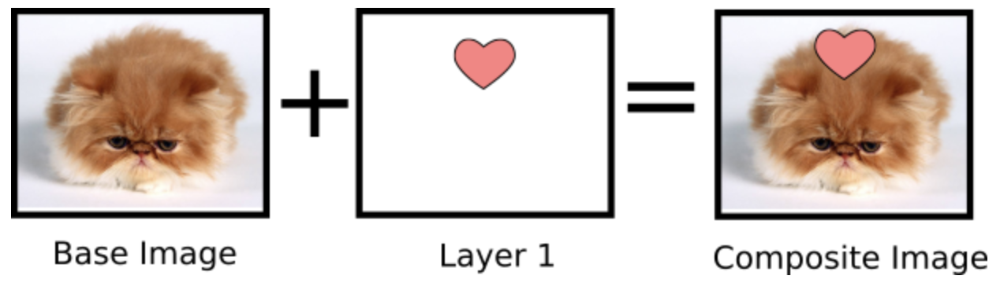

Alongside classmatee Aaron Yang, we explore graphical user interface programming. The application built features a model-view-controller design pattern to implement a photo-editing user stories. Using a callback API, we implemented a publish/subscribe pattern to make changes to the base image. 

The application allows users to add filters and multiple images to a base image. The user has the option to add their own images as well as scale, position, delete, and save their work onto their computer. 

## Overview 

The applicaiton interface features a tool bar implemented with GTK#'s widgets. This provides a simple user interface that is easy to understand and use. 

The user is provided with multiple features including exit from the application by quitting from the menu bar or closing the window, opening/saving image, adding/deleting layer images, and moving/scaling layers. 

## Architecture

This application uses the model-view-controller design pattern, allowing independent user-interface and backend models. The view-controller component is implemented in a class called MainWindow while the model component is implemented in the CompositeModel class. The event flow is managed with a publisher/subscriber API. MainWindow creates the menubar, toolbar, and canvas, registering callbacks on these components and modifying the back-end model. It also registers a callback on the CompositeModel to allow the canvas to update according to backend changes. The model component (CompositeModel) contains the base and composite images, along with a list of layers. 

The back-end model, part of the CompositeModel, is a class that manages the list of layers and supports an API for adding, deleting, and editing such layers. This class also loads the base class and saves the composite image.

This project was part of instruction assigned by Swarthmore College Professor Aline Normoyle 
